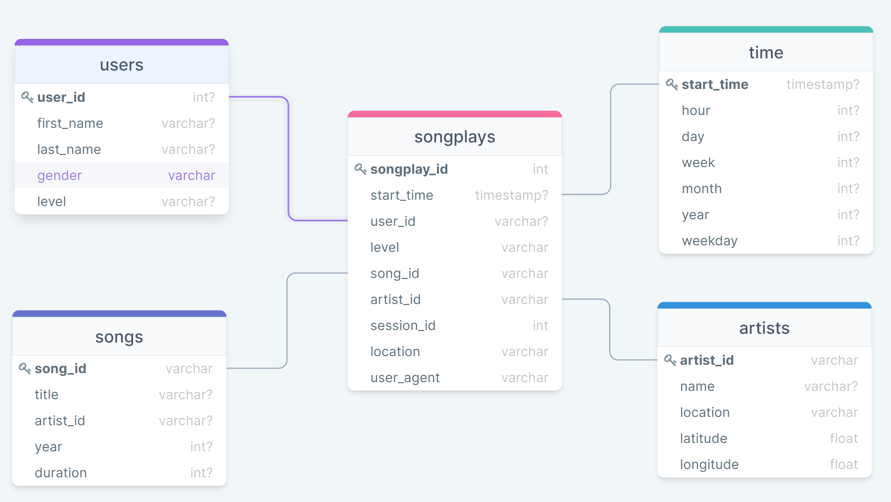

## Introduction
The project objective is to help a music streaming startup, Sparkify, to move their date warehouse to a data lake. Specifically, an ETL pipeline was built to extract its data from AWS S3 and process them using Spark, and then load the data into a new S3 as a set of dimensional tables. This will allow their analytics team to continue finding insights in what songs their users are listening to.

## Dataset
Datasets used in this project are provided in two public S3 buckets. Datasets used in this project were provided in two public S3 buckets, the objects in which are json files. One bucket contains information about songs and artists, the other bucket contains information about users' listening activities. 

## Database Schema
A star schema was optimized for queries on song play analysis as follows:

### Fact Table
- songplays - records in activity data regarding with song playing i.e. records with page NextSong

### Dimension Tables
- users - user information
- songs - songs in music database
- artists - artists in music database
- time - timestamps for recording songplays broken down into specific time units 

### The database schema is shown as follows:

## Spark Process
The ETL job processes the song files then the log files. The song files are listed and iterated over entering relevant information in the artists and the song folders in parquet. The log files are filtered by the NextSong action. The subsequent dataset is then processed to extract the date, time, year etc. fields and records are then appropriately entered into the time, users and songplays folders in parquet for analysis.

## Project Structure
- etl.py - The ETL to reads data from S3, processes that data using Spark, and then writes them to a new S3
- dl.cfg - Configuration file that contains info about AWS credentials
